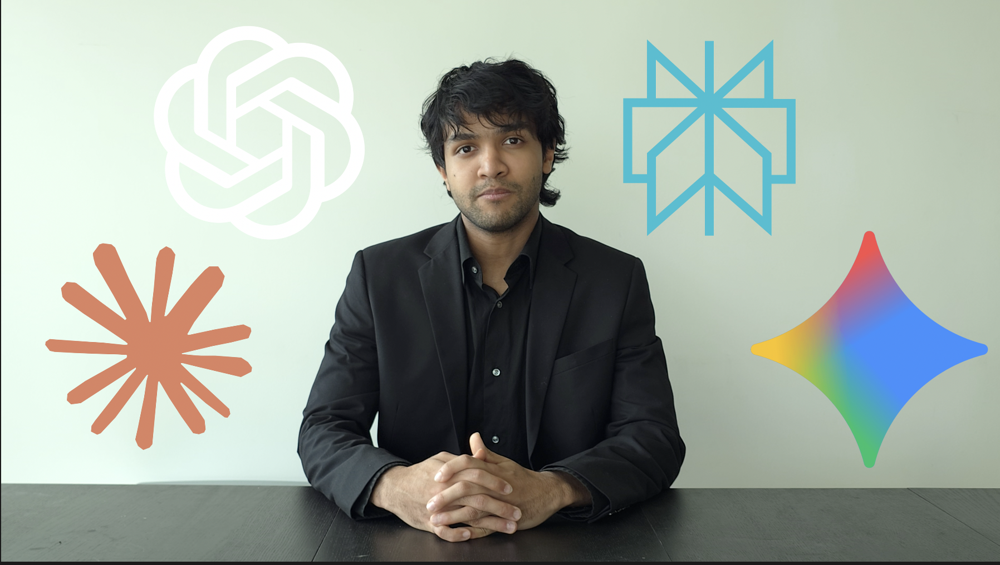

# PositioningAI — LLM Visibility Diagnostic



> See exactly how AI assistants represent your business — and get a concrete plan to fix it.

## What it does

1. **Fetches** your business website
2. **Finds competitors** via live Google search (Serper API)
3. **Embeds** everything into a shared vector space (OpenAI + ChromaDB)
4. **Simulates RAG** — how Perplexity / ChatGPT Search retrieves and synthesises answers
5. **Scores** your AI visibility across 10–15 real customer questions
6. **Queries AI engines directly** — optional live comparison across ChatGPT, Claude, Gemini, Perplexity
7. **Maps** your semantic position vs competitors in 2D (PCA with LLM-labelled axes)
8. **Generates** an improvement plan: priority fixes + ready-to-paste content + topic recommendations

---

## Quick start

### 1. Backend (FastAPI)

```bash
cd backend
pip install -r requirements.txt
python app.py          # → http://localhost:8000
```

### 2. Frontend (React)

```bash
cd frontend
npm install
npm run dev            # → http://localhost:5173
```

### 3. API keys

Enter your keys directly in the UI — they are never persisted server-side.

| Key | Required | Purpose |
|-----|----------|---------|
| OpenAI | Yes | Embeddings (`text-embedding-3-small`) + all LLM calls |
| Serper | Yes | Live Google search for competitor discovery |
| Anthropic | Optional | Query Claude in multi-engine comparison |
| Google AI | Optional | Query Gemini in multi-engine comparison |
| Perplexity | Optional | Query Perplexity in multi-engine comparison |

---

## Architecture

### 10-stage pipeline (`backend/pipeline/orchestrator.py`)

```
User URL
   │
   ▼
ingestion.py       ← scrape + chunk + extract business context (GPT-4o-mini)
   │
   ▼
retrieval.py       ← Serper search → scrape competitor pages
   │
   ▼
embeddings.py      ← embed all chunks → ChromaDB (in-memory, per-session)
   │
   ▼
rag_evaluator.py   ← per-question: retrieve top-k → LLM answer → visibility score 0–10
   │
   ▼
multi_engine.py    ← optional: query ChatGPT / Claude / Gemini / Perplexity directly
   │
   ▼
pca_visualizer.py  ← PCA on all embeddings → 2D Plotly → LLM axis labelling
   │
   ▼
blue_ocean.py      ← archetype classification + low-density opportunity zones
   │
   ▼
recommender.py     ← GPT-4o synthesises everything → structured action plan
```

Results stream to the frontend in real-time via **Server-Sent Events** (`GET /analyse/stream`).

### Project structure

```
backend/
├── app.py                    # FastAPI entry point
├── config.py                 # Pydantic settings
├── api/routes/
│   ├── stream.py             # GET /analyse/stream (SSE)
│   ├── analysis.py           # POST /api/analysis/start, GET /api/analysis/{id}
│   └── health.py             # GET /health
├── pipeline/
│   ├── orchestrator.py       # AnalysisPipeline: 10 stages + SSE events
│   ├── ingestion.py          # URL fetch, chunking, context extraction
│   ├── retrieval.py          # Serper search + competitor scraping
│   ├── embeddings.py         # OpenAI embeddings + ChromaDB
│   ├── rag_evaluator.py      # RAG simulation + scoring
│   ├── pca_visualizer.py     # PCA + axis labelling + Plotly
│   ├── blue_ocean.py         # Archetype + opportunity zones
│   ├── recommender.py        # GPT-4o strategy generation
│   └── multi_engine.py       # ChatGPT / Claude / Gemini / Perplexity queries
└── cache/session_store.py    # Thread-safe in-memory session dict

frontend/src/
├── api/
│   ├── client.ts             # SSE client + REST helpers
│   └── types.ts              # Shared TypeScript types
├── contexts/AnalysisContext.tsx  # Global state (results, progress, history)
├── pages/
│   ├── HomePage.tsx          # Form: URL + API keys + settings
│   └── ResultsPage.tsx       # Overview / Blue Ocean / Multi-engine tabs
└── components/
    ├── dashboard/            # DashHeader, HeroMetrics, Sidebar, panels
    └── ocean/                # OceanMap, BlueOceanPanel, ContentLab, RecommendationLab
```

---

## Features

### Content Lab
Re-score draft content against the same competitor embeddings — no re-scraping. Paste improved copy and instantly see whether your visibility score moves.

### Recommendation Lab
Generate a targeted content strategy toward any position on the semantic map. Click a target zone and get specific content recommendations to move there.

### Multi-engine comparison
Optionally query ChatGPT, Claude, Gemini, and Perplexity with the same customer questions and compare how each engine represents your business.

### Session history
Results are persisted in `localStorage` so you can compare runs over time without re-running the pipeline.

---

## Cost per analysis run (approximate)

| Component | Estimated cost |
|-----------|---------------|
| Embeddings (~350 chunks) | ~$0.004 |
| GPT-4o-mini (extraction + scoring) | ~$0.02 |
| GPT-4o (recommendations) | ~$0.02 |
| **Total** | **~$0.05 – $0.10** |

---

## Tests

```bash
cd backend
pytest tests/test_multi_engine.py -v             # unit tests (mocked, no API keys)
pytest tests/test_multi_engine.py -v -m live     # live tests (requires backend/.env)
```
